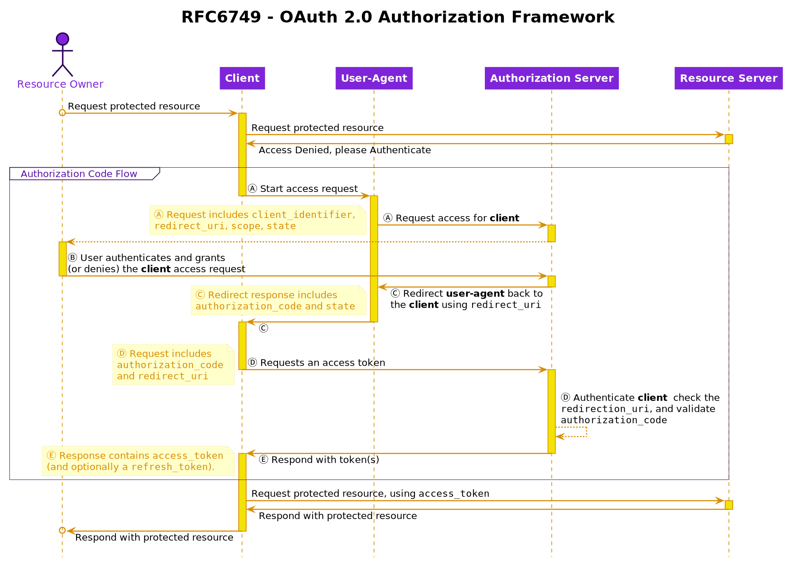

# Building a resource server in PHP

This article is part of a series describing how to implement a resource server
in PHP.

1. [Introduction](./01.introduction.md)
2. [Resource Server](./02.resource-server.md)
3. [Authorization](./03.authorization.md)
4. [Authentication](./04.authentication.md)
5. [Security Considerations](./05.security-considerations.md)

## Part 3: Authorization

> Authorization: Obtaining an access token 

When building an Authorization Server in PHP, a common implementation that can
be used is https://oauth2.thephpleague.com/

The code examples in this article come from https://github.com/pdsinterop/example-oauth-server/

If you feel more comfortable looking at implementations for a specific framework
in order to understand how all of this works, take a look at one of these 
integrations:

- [CakePHP 3](https://github.com/uafrica/oauth-server)
- [Drupal](https://www.drupal.org/project/simple_oauth)
- [OAuth 2 Server for Mezzio](https://github.com/mezzio/mezzio-authentication-oauth2)
- [Laravel Passport (Official)](https://laravel.com/docs/passport)
- [Nette Framework](https://github.com/lookyman/nette-oauth2-server)
- [Phalcon Framework](https://github.com/tegaphilip/padlock)
- Slim (or any PSR7-supporting framework) - See the examples in the PHP League OAuth client repository
- [Symfony](https://github.com/trikoder/oauth2-bundle)

## Authorization Code Flow

Using OAuth2, an authorization code can be retrieved from the Authorization Server.

The request and response flow goes through the following steps:

1. (A) The client initiates the flow by directing the resource owner's user-agent to the authorization endpoint. <!-- The client includes its client identifier, requested scope, local state, and a redirection URI to which the authorization server will send the user-agent back once access is granted (or denied). -->

2. (B) The authorization server authenticates the resource owner <!-- (via the user-agent) --> and establishes whether the resource owner grants or denies the client's access request.

3. (C) Assuming the resource owner grants access, the authorization server redirects the user-agent back to the client using the redirection URI provided earlier (in the request or during client registration). <!-- The redirection URI includes an authorization code and any local state provided by the client earlier. -->

4. (D) The client requests an access token from the authorization server <!-- 's token endpoint by -->, including the authorization code received in the previous step. <!-- When making the request, the client authenticates with the authorization server. The client includes the redirection URI used to obtain the authorization code for verification. -->

5. (E) The authorization server authenticates the client, validates the authorization code, and ensures that the redirection URI received matches the URI used to redirect the client in step (C). If valid, the authorization server responds back with an access token and, optionally, a refresh token.

As a sequence diagram it would look like this:



## Proof Key for Code Exchange (PKCE)

Under certain circumstance this process is open to an interception attack.

One way to prevent such an attack is by implementing PKCE. To quote from the RFC:

> To mitigate this attack, this extension utilizes a dynamically created
> cryptographically random key called "code verifier". 
>
> A unique code verifier is created for every authorization request, and its 
> transformed value, called "code challenge", is sent to the authorization 
> server to obtain the authorization code.
>
> The authorization code obtained is then sent to the token endpoint with the 
> "code verifier", and the server compares it with the previously received 
> request code so that it can perform the proof of possession of the "code 
> verifier" by the client.
>
> This works as the mitigation since the attacker would not know this one-time 
> key, since it is sent over TLS and cannot be intercepted.

What this comes down to in practice is that the Client sends some data to the
Server with the request it makes. The server remembers this data when it first
receives it and validates all following requests against this data.

This data is passed along in extra parameters in the following requests and 
responses:

- Access request
- Redirect response 
- Requests an access token
- Access token response

We'll look at these in more detail in a moment. First, lets look at the "extra 
data" that gets sent along.

### Code: Verifier, Method, and Challenge

The data that gets send along starts with some random bytes. The reason to use
random data is that it is virtually impossible to guess. This increases the level
of security. The longer the string is, the harder it becomes for possible 
attackers to guess the code.

Next, the random data is Base64 encoded to a URL-safe string. This is called the
`code_verifier`. By using SHA256 (or "S256") on the code verifier, the 
`code_challenge` is generated. As SHA256 is the method used to create the code
challenge, it is called `code_challenge_method`.

In PHP code, this would look like this:

```php
<?php

$verifier = random_bytes(64);
$code_verifier = base64_url_encode($verifier);

$code_challenge_method = 'sha256';

$challenge = hash($code_challenge_method, $code_verifier, true);
$code_challenge = base64_url_encode($challenge);

/* URL-safe Base64 encode, as PHP does not natively have this function  */
function base64_url_encode($subject): string {
    return strtr(rtrim(base64_encode($subject), '='), '+/', '-_');
}
```

Keeping this in mind, lets see how this is used in the requests and responses
we mentioned...

### Access request

When making the OAuth2 request, besides the `client_identifier`, `redirect_uri`, 
`scope`, and `state` we have seen in the Authorization Code Flow Ⓐ, two extra
parameters need to be added:

- `code_challenge` which contains the SHA256 hash of the `code_verifier`
- `code_challenge_method` to let the server know which hash method was used

### Redirect response 

When the server responds with an `authorization_code`, `redirect_uri`, and
`state` (as in Authorization Code Flow Ⓒ), it stores the `code_challenge` and 
`code_challenge_method` it received together with the `authorization code` it 
handed out, so they can be verified later.

This can be done by storing the data in the server or by sending an encrypted
version of the challenge back to the client as `code`.

<!--
    Typically, the "code_challenge" and "code_challenge_method" values
    are stored in encrypted form in the "code" itself but could
    alternatively be stored on the server associated with the code.  The
    server MUST NOT include the "code_challenge" value in client requests
    in a form that other entities can extract.
-->

As the verifier was not sent, there is no realistic way for an attacker to guess
what it was. At this point, only the client knows.

### Requests an access token

When the client requests an access token, sending the `authorization_code` and 
`redirect_uri` (as in Authorization Code Flow Ⓓ), it must now also add the 
`code_verifier`.

### Access token response

Before it can return an access token (as in Authorization Code Flow Ⓔ), the
server needs to verify the request.

Since the server now has the verifier, it can use the `code_challenge_method` it
stored from the previous request to create the `code_challenge` itself. It can
then use the challenge (which it _also_ received in the previous request) to
verify both hashes are the same.

If they match, the server knows it was the same client that made _both_ requests,
so it can return an access token (and optionally a Refresh Token) as usual.

Adding this to the sequence diagram, we get:

    TK: Create PKCE Flow diagram


## Demonstration of Proof-of-Possession  (DPoP)

One security vulnerability that remains is that, if the access or refresh
tokens were to be intercepted, they could be used over and over again in a so
called "replay attack". 

Here yet another standard comes to the rescue: OAuth DPoP

Quoting from the standard, a replay attack can be mitigated by:

> proof-of-possession based on a public/private key pair and application-level signing

This means that a client must show ("demonstrate") proof that it owns a private 
key belonging to a specific public key.

This proof is given to the server in the form of a JSON Web Token (JWT) that
contains data that has been signed by the client (using its private key).

The server can check the data against the public key to confirm it has indeed 
been signed by the client.

The JWT also contains a timestamp which limits the amount of time during which
it is valid.

This extra check is done during the Token Request (step Ⓓ in Authorization Code
Flow).

Again, as sequence diagram:

    TK: Create DPoP Flow diagram


## Resource Owner information

Information about the resource owner of a given access token.

## Scope

As mentioned in [Part 1](#) "authorization" is about access and permissions.

The key with which a client can ask an authorization server which permissions it
has received from a user is "scope".

The contents of the scope will be different for each authorization server, but
the mechanism is part of the OAuth2 standard.

By using scope, you can have fine-grained control over what resources an 
application has access to, or what it is allowed to do with certain resources.

If you've ever connected an application (with Facebook, GitHub, Google, Twitter,
etc) this will sound familiar. The "... wants to access your account" screen
is where an application asks you for access to specific scopes.

    TK: Add screenshot of one (or several) of these screens.

